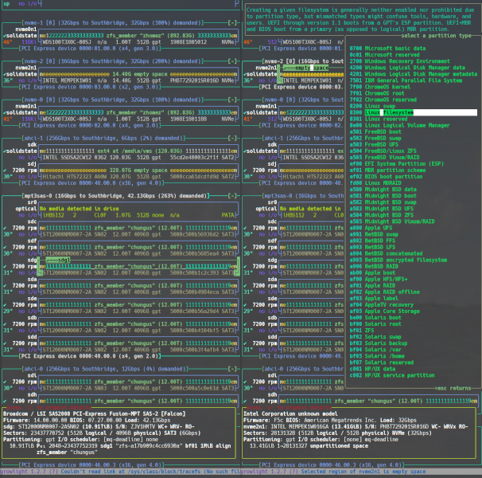

# growlight by nick black (nickblack@linux.com)

Block device manager and system installation tool.

https://nick-black.com/dankwiki/index.php/Growlight

<p align="center">

</p>

[](https://drone.dsscaw.com:4443/dankamongmen/growlight)

<a href="https://repology.org/project/growlight/versions">
 
</a>

Dependencies:

 - libatasmart 0.19+
 - libblkid 2.20.1
 - libcap 2.24+
 - libcryptsetup 2.1.5+
 - libdevmapper 1.02.74+
 - libnettle 3.5.1+
 - libnotcurses 3.0.0+
 - libpci 3.1.9+
 - libpciaccess 0.13.1+
 - libudev 175+
 - libz 1.2.11+
 - mkswap(8) from util-linux
 - badblocks(8), mkfs.ext4(8), mkfs.ext3(8), mkfs.ext2(8) from e2fsprogs

Kernel options:

 - CONFIG_DM_CRYPT (for device mapper encrypt aka LUKS)
 - CONFIG_MD_RAID* (for MDRAID)
 - CONFIG_MSDOS_PARTITION (for msdos partition tables)
 - CONFIG_EFI_PARTITION (for GPT partition tables)
 ... almost certainly more

Build-only dependencies:

 - pkg-config 0.29+
 - cmake 3.14+
 - pandoc 2.9.2.1+ (if building man pages)
 - doctest 2.3.5+ (if building unit tests)

Building:

 - mkdir build && cd build
 - cmake ..
 - make
 - (optionally) make check

### User's guide

In almost all cases, growlight needs to be run as root. It will attempt to
start otherwise, but will generally be unable to discover or manipulate disks.
You'll definitely need at least `CAP_SYS_RAWIO` and `CAP_SYS_ADMIN`.

Help can be found by pressing 'H' or 'F1' in `growlight`, or running `help`
in `growlight-readline`.

growlight's first action is to install inotify watches in several directories,
and then enumerate the current devices by walking same (`/sys/class/block`,
etc.). This way, it immediately learns of devices added or removed after
startup. growlight discovers block devices via these directories, and through
those block devices finds controllers. Controllers which do not have block
devices attaches will thus not generally be found (growlight will remain aware
of an adapter from which all devices are removed while it's running).

The highest level of structure in growlight is the controller ("controller" and
"adapter" are used interchangeably in growlight). A virtual controller is also
defined, to collect various virtual devices (especially aggregates). In the
fullscreen view, controllers are boxes labeled by their type, bus path, and
bandwidth. Below, we see a machine with one SATA SSD, a dmcrypt device mapper
block built atop that, and an unloaded SD card reader hanging off USB 3.0:

Navigate among the adapters using PgUp and PgDn. Bring up the details subscreen
with `v` to see full details about the adapter (along with other information).
Within an adapter, up and down moves between block devices, and left and right
move between partitions. Vi keys are also supported.

In the readline mode, adapters are listed via the `adapter` command (`-v` can
be provided to `adapter` for full details of attached devices and filesystems):

```
[growlight](0)> adapter
[ahci-0] Southbridge device 0000:00.17.0
 Intel Corporation Sunrise Point-LP SATA Controller [AHCI mode]
Virtual devices
[xhci_pci-0] Southbridge device 0000:00.14.0
 Intel Corporation Sunrise Point-LP USB 3.0 xHCI Controller
[growlight](0)>
```
